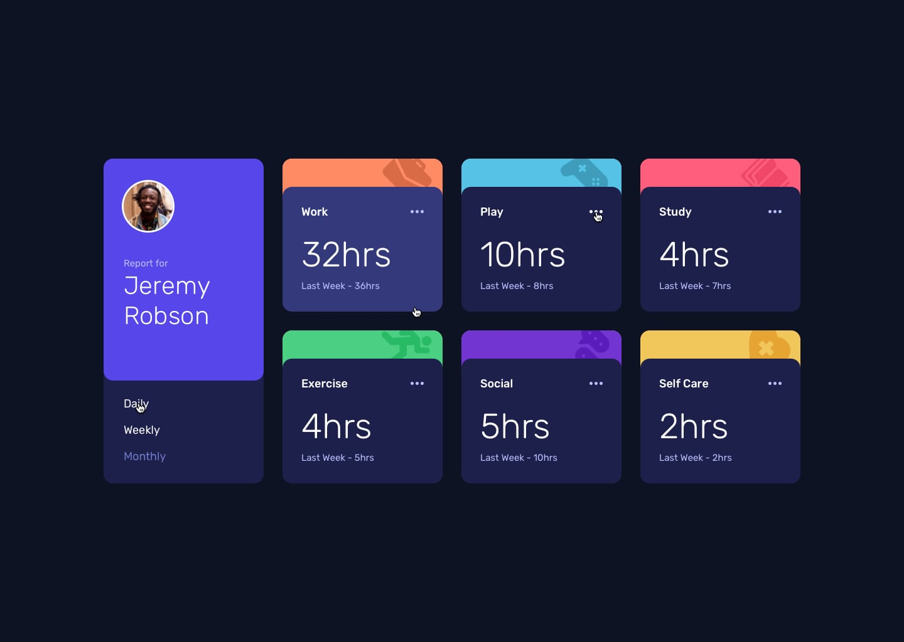

# Frontend Mentor - Time tracking dashboard solution

This is a solution to the [Time tracking dashboard challenge on Frontend Mentor](https://www.frontendmentor.io/challenges/time-tracking-dashboard-UIQ7167Eo). Frontend Mentor challenges help you improve your coding skills by building realistic projects.

## Table of contents

- [Overview](#overview)
  - [The challenge](#the-challenge)
  - [Screenshot](#screenshot)
  - [Links](#links)
- [My process](#my-process)
  - [Built with](#built-with)
  - [What I learned](#what-i-learned)
  - [Continued development](#continued-development)
  - [Useful resources](#useful-resources)
- [Author](#author)
- [Acknowledgments](#acknowledgments)

## Overview

### The challenge

Users should be able to:

- View the optimal layout for the site depending on their device's screen size
- See hover states for all interactive elements on the page
- Switch between viewing Daily, Weekly, and Monthly stats

### Screenshot

### Links

- Solution URL: [Add your solution URL here](https://your-solution-url.com)
- Live Site URL: [Add your live site URL here](https://your-live-site-url.com)

## My process

### Built with

- Semantic HTML5 markup
- CSS custom properties
- Flexbox
- Mobile-first workflow
- JavaScript (ES6)
- JSON data for activities

### What I learned

I focused on dynamically loading data from a JSON file and updating the UI based on user selections (Daily, Weekly, Monthly). This involved:

- Fetching and parsing local JSON data.
- Dynamically generating activity cards and populating them with current and previous period data.
- Implementing an active state for the time frame buttons.
- Updating the "previous period" text (e.g., "Yesterday", "Last Week", "Last Month") based on the selected timeframe.

### Continued development

In future projects, I'd like to explore:

- Implementing a more robust data management system, possibly using a framework like React or Vue for better state management.
- Adding animations for smoother transitions between timeframes.
- Enhancing accessibility features.

### Useful resources

- [Frontend Mentor](https://www.frontendmentor.io) - This is where I got the challenge.
- [W3Schools HTML, CSS, JavaScript Tutorials](https://www.w3schools.com/) - Great for quick lookups and refreshing knowledge.

## Author

- Frontend Mentor - [@yourusername](https://www.frontendmentor.io/profile/yourusername)
- Twitter - [@yourtwitterhandle](https://twitter.com/yourtwitterhandle)
- LinkedIn - [@yourlinkedinprofile](https://www.linkedin.com/in/yourlinkedinprofile/)

## Acknowledgments

Thanks to Frontend Mentor for providing such a great challenge to improve my skills.
